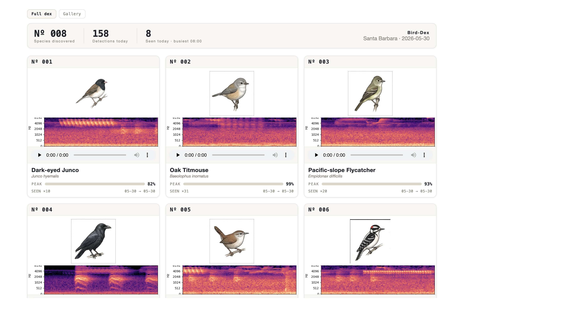
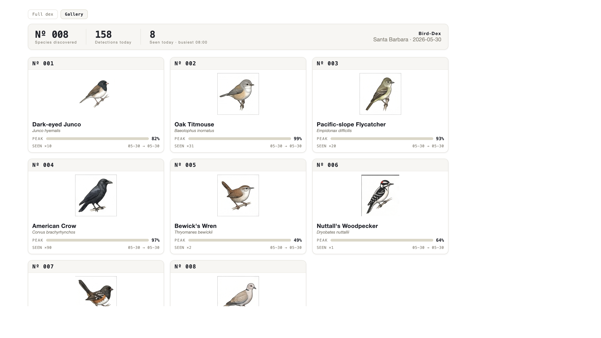

# bird-id

**A microphone in your yard that tells you who's visiting — and keeps a journal.**

Point a mic at your backyard, leave bird-id running, and come back to a personal
**Bird-Dex**: every species you've heard, when you heard it, and a recording of
the actual call. No app store, no subscription, no sending your audio to the cloud.



---

## What is this?

bird-id listens to bird sounds, figures out which species are calling, and saves
the results. Over days and weeks it becomes a running log of your yard — which
birds showed up, how often, and audio you can play back.

Think of it as a **field journal that writes itself**. The web dashboard turns
your sightings into a collection you can browse, like a pocket guide filled in
with *your* birds.

It uses Cornell Lab's BirdNET model, running entirely on your own computer. Your
recordings never leave the machine.

## Bird illustrations

The Bird-Dex cards show a realistic illustration for each common local species
(when we have one). We made them with **Google Gemini**: paste a prompt, get back
a grid of field-guide-style birds on a white background, then slice the sheet
into individual images in `realistic-sprites/`.

Gemini doesn't always paint the right bird in every cell, so some illustrations
were pulled from a second supplement sheet or generated one bird at a time. The
full Gemini prompts, species list, and chopping notes are in
[`docs/realistic-sprites-prompt.md`](docs/realistic-sprites-prompt.md).

## How it works

1. **Listen** — bird-id records audio from a microphone in short chunks.
2. **Identify** — each chunk is analyzed for bird calls; matches are saved with
   a timestamp and confidence score.
3. **Browse** — open the Bird-Dex dashboard to see your collection, play back
   calls, and check what's new today.

You can also point it at an existing recording file if you already have one.

## Get started

Requires **Python 3.12** on macOS (Apple Silicon tested). **Intel Macs** (e.g. an
older Mac mini) must use `requirements-intel-mac.txt` instead — pip only ships
TensorFlow through 2.16.2 on x86_64.

```bash
python3.12 -m venv .venv
./.venv/bin/python -m pip install -r requirements.txt          # Apple Silicon
./.venv/bin/python -m pip install -r requirements-intel-mac.txt  # Intel Mac
```

Copy `config.example.json` to `config.json` and set your latitude/longitude so
bird-id only considers birds that actually live near you. The included config is
set for Santa Barbara, CA.

**Try it on a recording** (no microphone needed):

```bash
./.venv/bin/python birdid.py identify ~/Desktop/bird.wav
```

**Import a file into the database** (same as identify, but writes a segment row):

```bash
./.venv/bin/python birdid.py identify ~/Desktop/bird.wav --save
```

**Run it continuously** (the main idea — leave it going):

```bash
./.venv/bin/python birdid.py monitor
./.venv/bin/python birdid.py dashboard    # → http://127.0.0.1:8080
```

The dashboard works offline — no internet required once it's running. Browse by day
or all-time, open a species for clips and spectrograms, click **◳ 3D** on a dex card
for the **Call Chamber** (`/call`) — an orbitable 3D frequency-pole visualization
synced to clip playback — open **Live feed** (`/live`) for a rolling 24-hour timeline
that auto-updates while you monitor, open **Twitter view** (`/twitter`) for an
all-time, scrollable timeline of every detection sorted by latest or top confidence,
with dark/light mode, or open **Data report** (`/data`) for detection counts and
confidence charts.

Gallery mode (`/?mode=gallery`) is a lighter grid of illustrations and stats — no
spectrograms or audio:



## Daily digest

```bash
./.venv/bin/python birdid.py digest
```

A quick terminal summary: how many species today, busiest hour, and anything
**new to your records**.

---

## More commands

| What you want | Command |
|---|---|
| Record a few seconds from the mic | `./.venv/bin/python birdid.py record out.wav -t 5` |
| Record + identify in one step | `./.venv/bin/python birdid.py listen -t 5` |
| Running tally while monitoring | `./.venv/bin/python birdid.py stats` |
| Long file, one row per species | `./.venv/bin/python birdid.py identify big.wav --summary` |
| Import a recording into the DB | `./.venv/bin/python birdid.py identify file.wav --save` |
| Dashboard on your home network | `./.venv/bin/python birdid.py dashboard --host 0.0.0.0` |
| Live companion feed (phone-friendly) | Open `/live` while monitor runs — polls every 5s |
| Dashboard auto-reload while hacking | `./.venv/bin/python birdid.py dashboard --dev` |

**Useful flags:** `-c 0.5` raises the confidence threshold (fewer false positives).
`-d 1` picks a specific mic — list devices with `./.venv/bin/python recorder.py --list-devices`.

If recording comes back silent, check macOS mic permission:
*System Settings → Privacy & Security → Microphone → enable your terminal app.*

## Configuration

`config.json` holds your location, confidence threshold, and where data is stored:

```json
{ "lat": 34.4208, "lon": -119.6982, "min_conf": 0.3,
  "db": "birdid.db", "recordings_dir": "recordings" }
```

Setting location is the single biggest accuracy win — it stops the model from
suggesting birds that don't belong in your area or season.

## Testing

For contributors — fast tests with no mic or BirdNET (see `AGENTS.md` for manual smokes):

```bash
./.venv/bin/python -m pip install -r requirements-dev.txt
./.venv/bin/python -m pytest -q
```

CI runs the same suite on push (`.github/workflows/test.yml`).

## Project layout

For contributors and the curious — see `AGENTS.md` for design notes and invariants.

| File | What it does |
|---|---|
| `birdid.py` | CLI — the commands above |
| `dashboard.py` | Bird-Dex web UI |
| `recorder.py` | Microphone → audio file (macOS) |
| `identifier.py` | Audio file → bird detections |
| `storage.py` | SQLite database and queries |
| `config.py` | Loads `config.json` |
| `tests/` | Pytest suite (`storage`, `config`, dashboard routes, etc.) |

## Mac mini database backup

The always-on monitor runs on a Mac mini (`~/bird-id` as user `matt`). To copy a
consistent snapshot to your dev machine (SSH host `mac-mini` in `~/.ssh/config`):

```bash
chmod +x scripts/pull_db_from_mini.sh   # once
./scripts/pull_db_from_mini.sh
./scripts/pull_db_from_mini.sh --activate   # also replace ./birdid.db for local dashboard
```

Writes `birdid.db.local-backup-YYYYMMDD-HHMMSS` in the repo root (gitignored).
Uses SQLite `.backup` on the mini so it is safe while the monitor is writing.

**Segment wavs for local testing** (identify replays, dashboard playback — not a full sync):

```bash
./scripts/pull_recordings_from_mini.sh              # 30 newest segments
./scripts/pull_recordings_from_mini.sh --recent 50
./scripts/pull_recordings_from_mini.sh --all        # every seg_*.wav on the mini
./scripts/pull_recordings_from_mini.sh seg_20260601_131822.wav
```

## Roadmap

- [x] Continuous backyard monitoring with audio playback
- [x] Bird-Dex web dashboard with illustrations and call clips
- [x] Daily digest and "new species" tracking
- [x] Location/season filtering
- [x] Import recordings into the DB (`identify --save`)
- [x] Automated pytest suite (no TF in CI)
- [ ] Always-on setup on a Mac mini or Raspberry Pi with a USB mic
- [ ] Alerts when a rare or first-time species shows up
